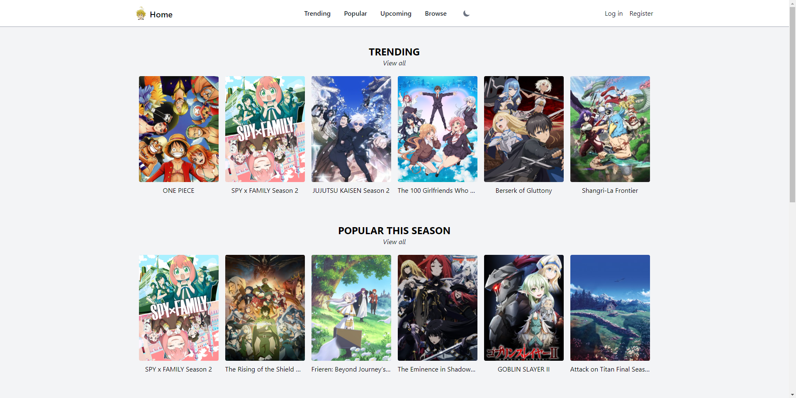
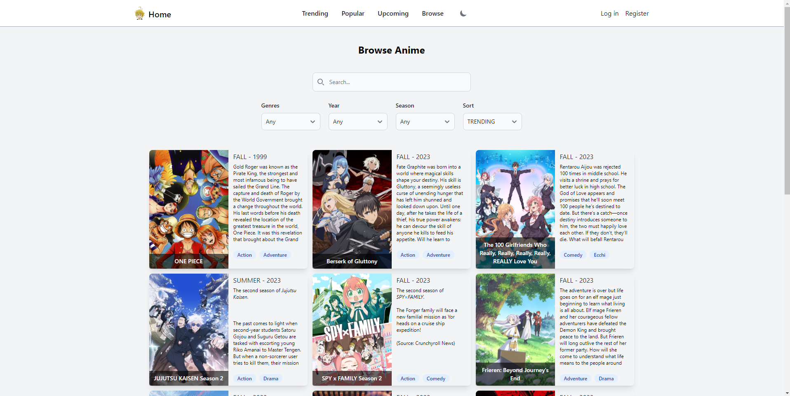
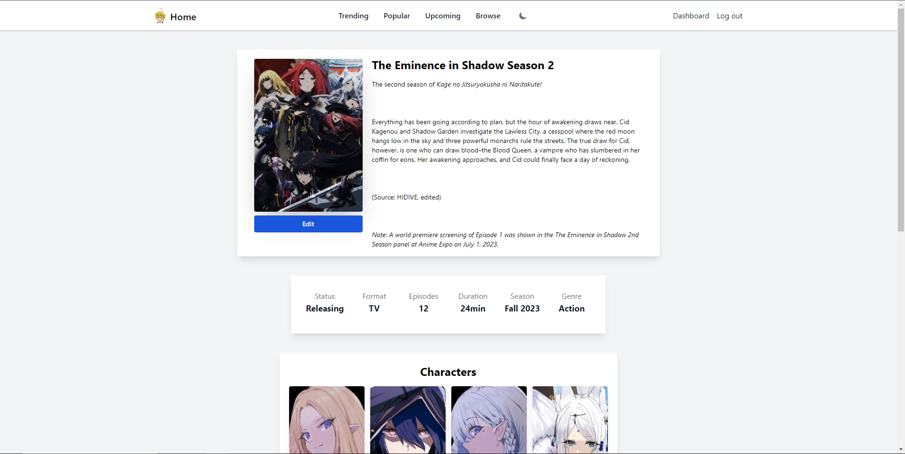
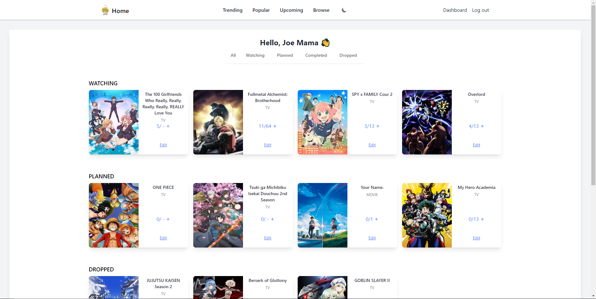
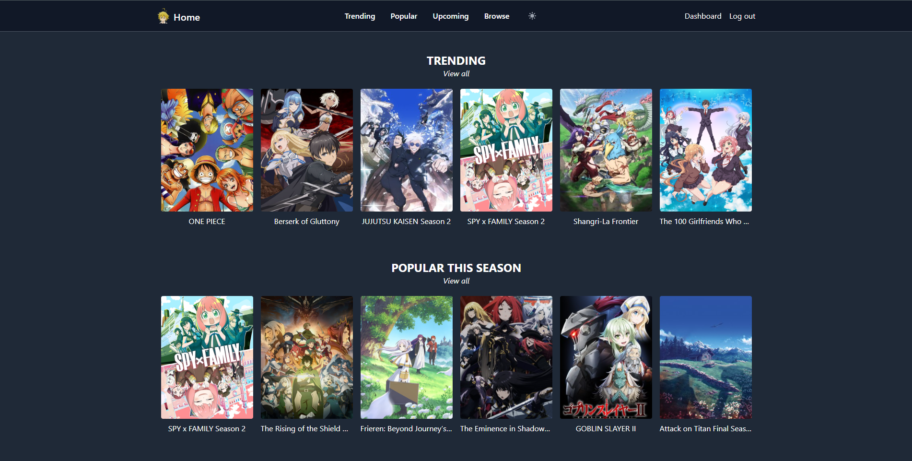
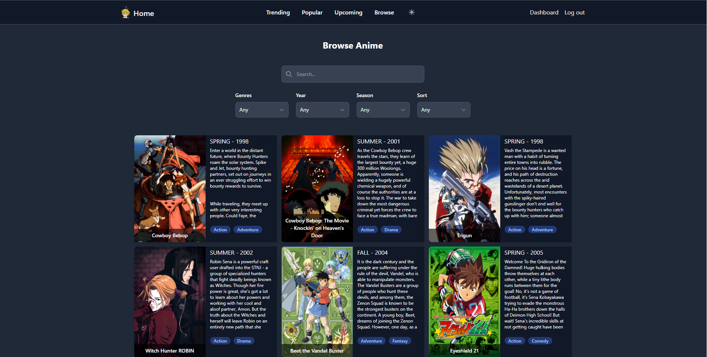
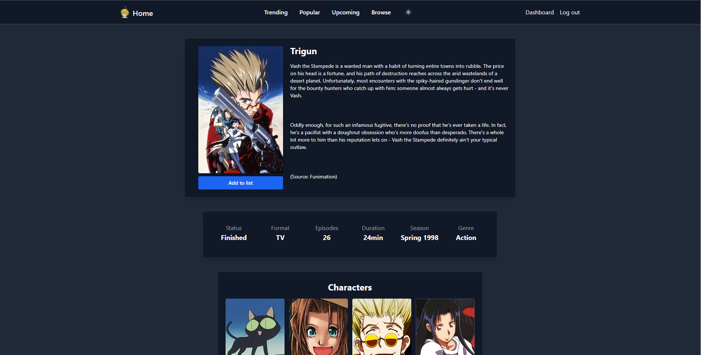
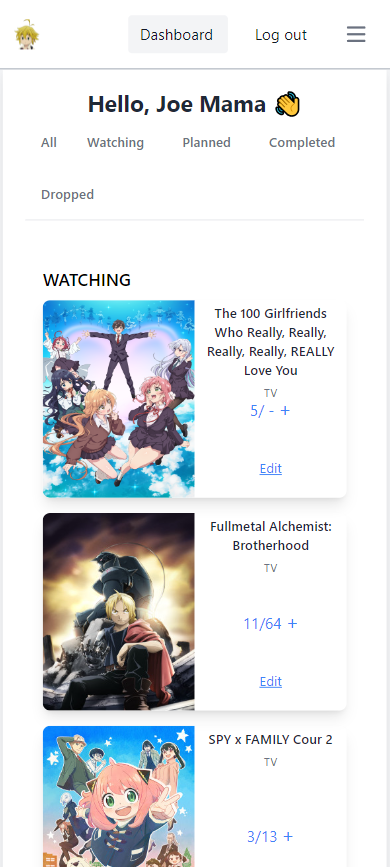
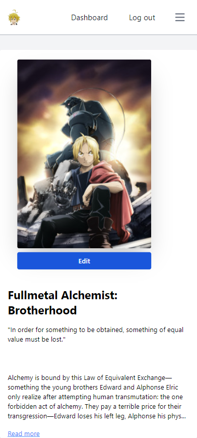

# ANIME WEB APP

This project is a simplified web application inspired by anime webistes like [MyAnimeList](https://myanimelist.net/) and [Anilist](https://anilist.co/search/anime), offering features to track and explore anime titles.

The project is powered by [AniList API](https://anilist.gitbook.io/anilist-apiv2-docs/)

## Technologies

### Frameworks
* React 
* Laravel 

### Libraries
* TailwindCSS
* Flowbite
* Apollo Client
* Axios
* React Query
* React Router
* React Toastify

## Features

### Authentication System

* Register/Login/Log out.
* Error feedback messages.

### List Management

* Users have access to a personal Dashboard where they can manage their added anime entries (update progress, status etc...).

### Browse Page

* Dynamic search bar for discovery of anime titles.
* Filter options for refining search results based on criteria such as genre, season, release year and sort results by popularity or trending.

### Responsive Design

* Fully responsive and mobile-friendly.

### Toasts

* Flash messages to provide users with immediate feedback.

### Dark Mode Toggle

* Users can switch between light and dark themes for the interface

### And more...

## Usage

1. Clone the project
2. Copy `.env.example` into `.env` and configure database credentials
3. Navigate to the project's root directory using terminal
4. Run `composer install`
5. Set the encryption key by executing `php artisan key:generate --ansi`
6. Run migrations `php artisan migrate`
7. Start local server by executing `php artisan serve`
8. Open new terminal and navigate to the `react_` folder
9. Copy `react/.env.example` into `.env` and adjust the `VITE_API_BASE_URL` parameter
10. Run `npm install`
11. Run `npm run dev` to start vite server for React

## Demo Images

    
    
    
    
    
    
    
    
    

